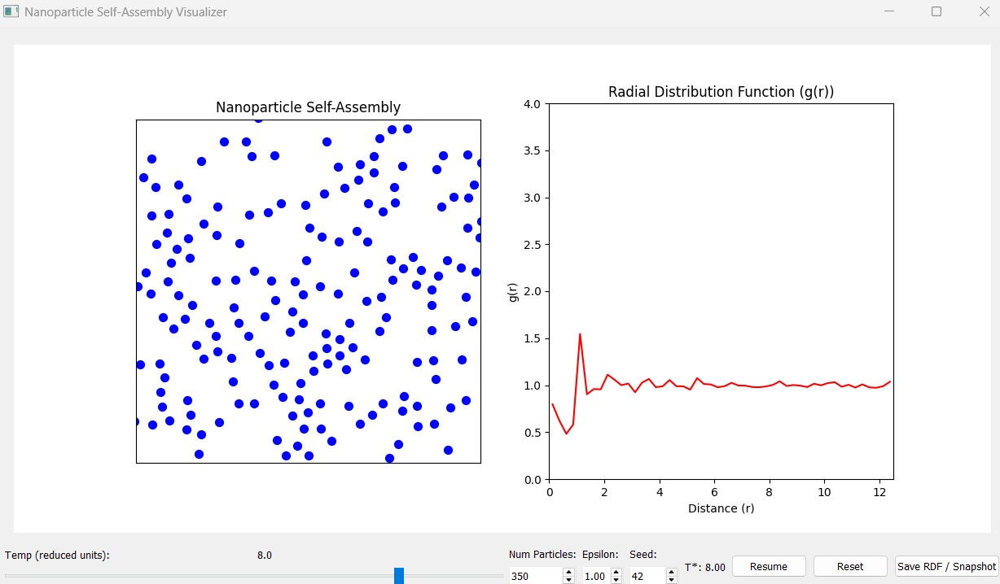
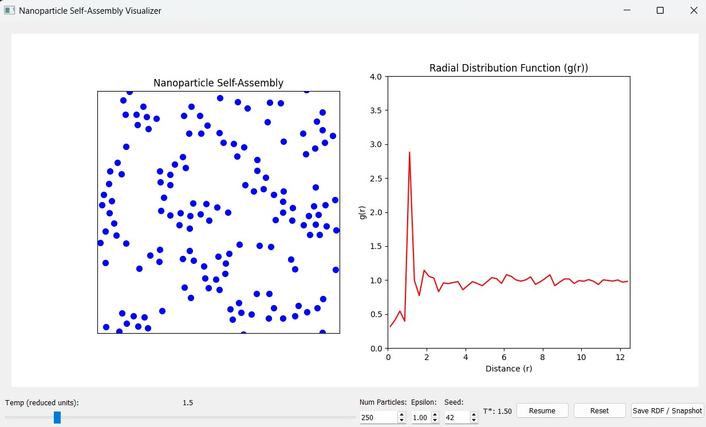
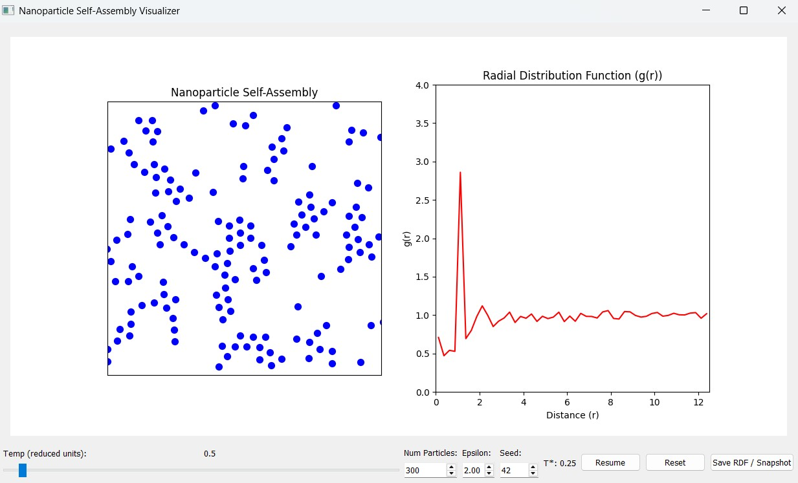

# A Nanoparticle Self-Assembly Visualizer

This project is a small interactive program I built to help myself (and hopefully others) understand **how nanoparticles self-assemble** under different conditions.

It’s not a full-blown research engine like LAMMPS or GROMACS, but intended as a teaching/demo tool that runs in real time and shows how **temperature, interaction strength, and density** affect particle ordering.

---

## Features

    --> Lennard–Jones molecular dynamics in 2D with periodic boundary conditions.
    --> Adjustable parameters:
        - Temperature (reduced units): Controls particle kinetic energy.
        - Epsilon (ε): Strength of interaction (depth of LJ potential well).
        - Number of particles: Control density and statistics.
    --> Real-time visualization of:
        - Particle positions (self-assembly in action).
        - Radial Distribution Function (g(r)) (structural information).
    --> Smoothing built into the RDF so you see clearer trends, not just noisy fluctuations.
    --> Reset button to restart the system with new initial conditions.

---

## Scientific Background

**1. Lennard-Jones Potential:**

The simulation uses the Lennard–Jones (LJ) potential to model how particles interact. It is one of the simplest and most widely used models in molecular dynamics:

```
U(r) = 4 * ε * [ (σ / r)^12 – (σ / r)^6 ]

Where,
r is the distance between two particles
ε (epsilon) is the interaction strength (depth of the potential well)
σ (sigma) is the particle diameter, or the distance at which the potential changes sign (set to 1.0 in this project)

```

**2. Reduced Temperature:**

The simulation is performed in reduced units, which is standard in LJ systems. This means:

```
Boltzmann constant 'k_B' = 1

Particle mass 'm' = 1

Particle diameter 'σ' = 1

With these choices, the temperature is expressed as:

T* = k_B * T / ε --- (i)

But since k_B = 1, this reduces to simply:

T* = T / ε --- (ii)

where T* is called the reduced temperature
```

In this project:

**Low T (≈ 0.5–1.0)** → particles have low kinetic energy, so attractions dominate. They can cluster or form ordered (crystal-like) patterns.

**Moderate T (≈ 1.5–2.5)** → there is a balance between motion and attraction. The system resembles a liquid, with short-range order but no long-range structure.

**High T (> 3.0)** → kinetic energy dominates, attractions cannot hold particles together, and the system behaves gas-like.

**3. Radial Distribution Function (g(r)):**

The radial distribution function (RDF), also called pair correlation function, is a statistical measure of structure. It describes the probability of finding a particle at a distance r from another particle, relative to an ideal gas.

```
Gas-like systems → g(r) is approximately 1 at all distances (particles are randomly distributed).

Liquids → g(r) shows a strong first peak (nearest neighbors), followed by damped oscillations. This means particles have short-range order but no repeating lattice.

Crystals → g(r) has multiple sharp peaks at well-defined positions, corresponding to the lattice spacing of an ordered solid.
```

In experiments, RDF is directly related to what is measured in X-ray or neutron scattering experiments on nanoparticles and liquids, so this project mirrors a real scientific analysis tool.

## Example Observations (w/ Screenshots)

Below are three representative cases showing how the system behaves under different conditions. The **left panel** shows particle positions in the simulation box, and the **right panel** shows the **radial distribution function g(r)**, which is the structural fingerprint of the system.

**Case 1 - Gas-like State:**



        # Parameters:
        Temperature = 8.0 (reduced units), Epsilon = 1.0, Number of Particles = 350, T* = 8.0

_Observation:_

The particles are spread randomly across the box with no clustering. The RDF is nearly flat at ~1, which means particles are distributed like an ideal gas.

_Interpretation:_

At very high temperature relative to interaction strength, thermal motion dominates and the system behaves like a gas.

**Case 2 - Liquid-like State:**



        #Parameters: Temperature = 1.5 (reduced units), Epsilon = 1.0, Number of Particles = 250, T* = 1.5

_Observation:_  
Particles form local neighborhoods, but there is no long-range ordering. The RDF shows a strong first peak (nearest neighbors) followed by damped oscillations.

_Interpretation:_

This is characteristic of a liquid, where short-range order exists but long-range structure is absent.

**Case 2 - Crystal-like State:**



        #Parameters: Temperature = 0.5 (reduced units), Epsilon = 2.0, Number of Particles = 300, T* = 0.25

_Observation:_  
Particles appear more densely packed, with hints of ordering across the box. The RDF shows a very sharp first peak and additional peaks at larger r, which indicates long-range periodicity.

_Interpretation:_

At low temperature and high interaction strength, attractive forces dominate and the system organizes into an ordered (crystal-like) structure.

## How to Run

If you're on Windows, go into Command Prompt, and type:

```
pip install numpy matplotlib PyQt5

```

Then, navigate to the folder which contains this project, for example

`cd Desktop\nanoparticle-self-assembly-visualizer`

On Mac/Linux it’s the same idea, just with forward slashes:

`cd ~/Desktop/nanoparticle-self-assembly-visualizer`

Then, just run:

`python main.py`

## Limitations

- The simulation is restricted to two dimensions, while real nanoparticle self-assembly occurs in three dimensions.

- The system size is relatively small (a few hundred particles), which means the radial distribution function (RDF) can appear noisy.

- The simulation uses a simple thermostatting method (velocity rescaling), which is not as rigorous as methods used in advanced molecular dynamics software.

- This project is intended primarily as an educational and demonstration tool, and not as a research-grade simulator.

## About This Project:

I made this as a self-learning + portfolio project during my materials engineering journey.
I wanted a hands-on way to connect coding with nanoscience concepts (self-assembly, RDF, LJ interactions).

It’s small, not perfect, but it taught me a lot and I think it could be useful for students or anyone curious about how simple particle interactions can lead to emergent order.
